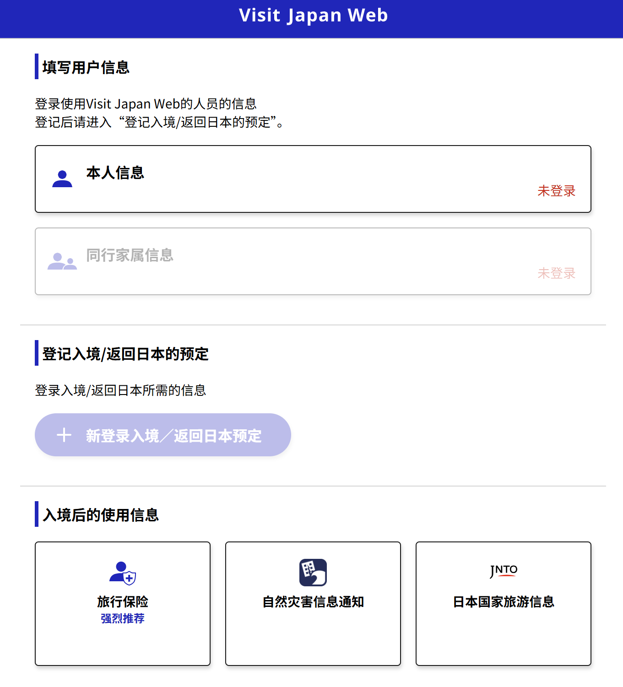
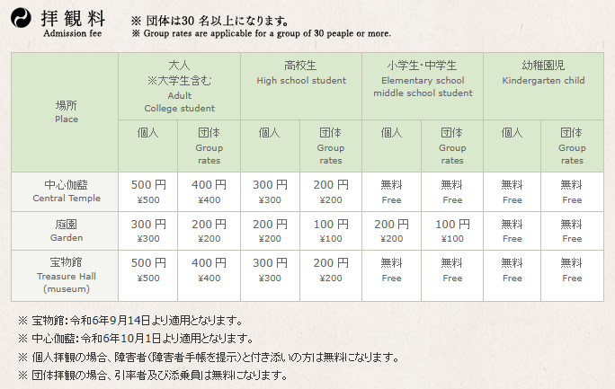

# 索多玛十日

**2025.8.5——2025.8.15 日本行不完全攻略**

[TOC]

## Part 0 前言·更新目录{#Part 0 前言·更新目录}

出现“**zkz:**”的部分不要跳过，文中的超链接最好都看一遍，而且我塞了一堆私货。

#### 2025.8.4

更新 安全、出入境流程、支付方式/货币

## Part I 出行前准备以及必要知识{#Part I 出行前准备以及必要知识}

#### 通讯（这段基本照搬98）{#通讯}

微信公众号搜“中国移动无忧行”会有官方公众号和教程，这个app非常强。因为只要手机有网络（无论是wifi还是其他卡的流量），卡槽里不用插卡，可以直接把卡挂在无忧行app上，免费接收短信，免费接电话，而且完美匹配 iPhone 和小米的系统级电话接听（华为没试过）。中国移动的卡的好处就体现在上面的“无忧行”app上，不用开国际漫游，照样收短信接电话。不仅在国外，在国内也能这么操作，所以这个app让双卡的手机可以同时三卡三待，堪称神中神。

**强烈建议不要用国内的卡出国漫游**,我仔细研究过，漫游归属地和谷歌地图使用的相关问题。当时成田机场落地后，国内卡直接定位失效。直接买当地的卡（我的意思是买日本的卡，到日本后激活用，不是说到了日本再去买卡，在日本买卡容易被宰）。还有，注意是esim还是sim卡，一定要买sim卡，因为中国售卖的手机暂时不支持esim，不要买错了！

**zkz**：我看了一下飞猪上的价格，十天无限流量90块钱，插卡即用。淘宝搜“日本sim卡”，就会跳出飞猪。当然三个人带移动wifi也可以，300块。

#### 安全{#安全}

驻日本大使馆领事保护与协助电话：+81-3-6450-2195

大阪总领馆领事保护与协助电话：+81-6-6445-9427

**关于拨打电话：**

在国内/日本拨打日本电话，开头都要加上+81，并且去掉号码第一位的0（日本的所有号码都是0开头，上面两个号码以及去掉了）；

拨打国内电话，需要加上+86，如果是固定电话也要去掉0（0578开头的这种）；

国内打我们正常打

#### 语言{#语言}

我们当中没人会日语（笑）。

#### 支付方式/货币{#支付方式/货币}

VISA卡、现金

日元尽量在国内换好，最好带一个钱包

我用的是建设银行，可以直接app上预约网点去取。

大部分商场、便利店已经支持微信支付宝支付，但仍然有很多店未普及

日本当地一些便利店有日元兑换机器，收手续费

**另外，先用零钱**

#### 消费{#消费}

**相信每个人都有自己想买的东西/拜托带的东西，所以我每个城市都预留了自由时间，至于具体店铺需要大家自行查找，我在正文部分提供的 购物建议 部分，仅仅是列出最有名的那几个特产或者购物中心，难免会遗漏私房好店，还请包涵。**

不得不提的是一些奢侈品比如包包在日本相对便宜，可以人肉背回来。

目前日本的消费税率为10%，作为短期停留的游客，可以通过在结账时必须向店员出示护照原件（不可用复印件）或通过Visit Japan Web生成的「免税购物二维码」扫描码，店员会当场在你的收银小票上处理免税，将商品装入“免税专用袋”并附上免税凭证，**切记不要打开袋封，直至离境。所有免税手续当日完成，不可补办。**

达到退税标准金额

一般物品（General Goods）：单次同店消费金额（不含税）须达到 5,000 日元以上。

消耗品（Consumables）：单次同店消费金额（不含税）须在 5,000 ～ 500,000 日元之间。

#### 交通{#交通}

推荐先阅读这个网页的内容，了解一些专有名词，电脑ctrl+左键点击打开

**zkz：我会放一堆超链接，打开方式都相同**

[瞭解日本大眾交通工具-新幹線、JR、私鐵、路面電車、登山纜車、空中纜車介紹與說明 – 小氣少年的部落格](https://nicklee.tw/japan-public-transport/)

具体的交通方式在按日规划时再说

建议办一张[Suica](https://nicklee.tw/1640/jreast-suica/)或者[ICOCA](https://nicklee.tw/1146/icoca/)，这俩都是交通储值卡，刷卡进站，出站自动结算费用，Suica 与 ICOCA、PASMO、Kitaca、Toica、manaca、PiTaPa、SUGOCA、nimoca、Hayakaken 等均可相互使用，无需再额外购卡。

#### 暴食{#暴食}

tabelog这个app，相当于大众点评。

以及我在下面正文列出的餐厅都只是参考。

#### 杂项 Misc{#杂项 Misc}

ISIC国际学生证，在微信小程序就可以申请，不少景点有学生优惠。

[动画巡礼](https://anitabi.cn/)

[小气少年](https://nicklee.tw/)

**zkz:**我不知道iPhone怎么样，我鸿蒙的话是下了出境易，然后把tabelog等要用到的应用装里面了。

## Part II 正式行程{#Part II 正式行程}

| 日期区间              | 城市   | 计划天数 | 备注         |
| --------------------- | ------ | -------- | ------------ |
| 8 月 5 日（傍晚前后） | 大阪   | 2 晚     | 无           |
| 8 月 7 日–10 日       | 京都   | 3 晚     | 无           |
| 8 月 10日–13 日       | 东京   | 3 晚     | 无           |
| 8 月 13 日–14 日      | 诹访湖 | 1 晚     | 有温泉哦 ^_^ |
| 8 月 15 日            | 大阪   | 1晚      | 14日晚在大阪 |

### 一定要看部分:

**zkz:**大阪前两天我会写得比较仔细，因为刚到，之后熟悉了，我会列出景点大家选就行，反正酒店都定好了，景点门票不会缺，**我的基本思路是每个城市待三晚，两天游玩，剩下一天自由安排（购物、逛街、圣地巡礼之类的），然后一天在诹访湖。**

### 而且带了相机肯定得好好拍照😋

### 出入境流程

首先介绍[vjw官网](https://services.digital.go.jp/zh-cmn-hans/visit-japan-web/)，部分航空公司在出行前会要求现场扫签证上的二维码，然而有时候会出现二维码失灵的情况，可以注册一个vjw账号同步visa签证信息，当二维码失灵时可以在这里核实，之后还会用到。

**从虹桥火车站到浦东机场**

沪✌是有市域铁的，直接串联了两座机场，我们是要去浦东机场，直接坐就行，支持上海公交地铁乘车码，两边的站台交替发车，15分钟一班，看哪边快去那边就可以，发车后大概40分钟到达。

**国际航班的乘坐流程**

首先在值机处取得登机牌，办理托运，再通过海关，海关禁止摄像，中国公民只需要护照、人脸、指纹就可以通关（不用身份证，丢了也别急）

再去安检，安检时需要把充电宝、平板电脑、所有带电池的设备取出，容积在100ml内的液体可以放随身行李，其余的只能托运，当然的，易燃易爆标识的香水、防晒喷雾等不能带/托运；

通过安检后，找到登机口等就行了，不过有时候会换登机口，所以要留意广播。

**入境日本**

传统的入境方式是在入境处排队，或在飞机上填写纸质申报单；

**常规入境流程**

入境检查，扫护照、拍照、按指纹
入境申报，盖上陆许可贴纸
取行李、海关申报，出机场

**关西机场电子渠道入境流程**

下飞机之后跟着`Arrival`指示牌走（也许要坐摆渡车）

先去申报机器扫vjw码，扫护照、拍照、按指纹

再根据提示的a、b、c、d标记字母去对应队伍排队，会在护照上贴上陆许可贴纸，下扶梯取行李，按标记字母的通道走海关

哦咩跌多，你完成了所有入境手续🤗

嗨嗨，这就用到我前面说的[vjw官网](https://services.digital.go.jp/zh-cmn-hans/visit-japan-web/)辣😋，这个网站还可以获得入境卡+海关申报的二维码，截图后凭码可以走电子入境通道。

界面如下：

注册、登录账号之后点击“新登录入境”（由于我没登录，所以是灰色的，登录需要护照），填写航班、酒店等信息（酒店地址填不来的话可以直接邮政编码导入）

填完入境信息再点“入境审查与海关通报”，都填完之后，就可以生成QR码了，**这个相当于生成了入境申报和海关申报二合一的二维码，不限提前填写的时间，定好机票酒店就可以填了，二维码不会动态更新**。

回国流程待更新

### 8月5日·大阪

**从关西机场到旅店**（约55分钟）

[小气少年的指南](https://nicklee.tw/2274/kansai-airport-to-niponbashi/)

[南海电铁官网指南](https://www.howto-osaka.com/cn/access-fromkix/)

我们的路线是从关西机场乘坐机场急行 南海难波至天下茶屋，然后沿堺筋线坐地铁到长堀桥，步行到旅店，[官网票价](https://kensaku.nankai.co.jp/pc/N2?rp=0&tp=0&sf=%8A%D6%90%BC%8B%F3%8D%60%89w&st=%93V%89%BA%92%83%89%AE%89w&hour=17&min1=3&min2=0&month=202508&day1=0&day2=5&sr=0&ep=0)

入住之后先休息一下整理下东西出发前往梅田，晚饭在一蘭拉面 梅田阪急東通店（Ichiran Umeda Hankyu-higashidori）吃，人均（1000-2000y）不支持预定，拉面店基本都现场排队取号。

**交通：**旅店步行270M至长堀桥站（長堀橋駅），沿堺筋线天神桥筋六丁目 / 北千里 / 高槻 / 京都方向至南森町站，转谷町线天神桥筋六丁目方向，东梅田（東梅田駅）下车，步行450m至拉面店

晚上hep five观景摩天轮，这几个点离一兰拉面都比较近（摩天轮550米）完全可以步行逛街。

**注：**11点20前得到东梅田站准备返回，不然有可能赶不上南森町返回的末班车，也不安全。

### 8月6日·大阪

8点起床，旅馆是不提供早餐的，附近早餐店蛮多的，完全可以临时考虑，真不行去楼下食兰州拉面（笑），这里贴一条参考（450m）[Karahori toast cafe Fine](https://www.google.com/maps/dir/&#39;&#39;/Karahori+toast+cafe+Fine,+5-5+Matsuyamachi,+Chuo+Ward,+Osaka,+542-0067/@34.6734138,135.5091316,17.96z/data=!3m1!5s0x6000e7392fb1feaf:0xd96614e77bc4a303!4m13!4m12!1m5!1m1!1s0x6000e70067cba31d:0xfaf6a295ca58d1e7!2m2!1d135.5081266!2d34.6726322!1m5!1m1!1s0x6000e7392f7f947b:0xa8eb89616108898f!2m2!1d135.511637!2d34.67382?entry=ttu&amp;g_ep=EgoyMDI1MDcxMy4wIKXMDSoASAFQAw%3D%3D)

9点前往大阪城公园及天守阁，大阪城公园不需要门票，天守阁需要（1200y，学生600y，可以网站预约），大阪城天守阁矗立于雄伟的大阪城中心。八楼的观景台可一览大阪城公园和大阪平原的壮丽景色，展览室则提供丰富的历史资料。在大阪城丰臣石墙资料馆，可以深入地下，参观由德川幕府填筑的丰臣时代石墙。

**交通：**长堀桥站往门真南方向至森之宫（长堀鹤见绿地线）

逛的差不多去天王寺区，这一块主要就是佛教寺庙比较多，四天王寺、有栖山 清光院 清水寺、天王寺公园

四天王寺门票

**zkz：**我的话想带点天王寺乌龙茶回去，以及我们如果8月13日回来的话正值盂兰盆节，参不参加另说，反正人肯定很多，[四天王寺官网通知](https://www.shitennoji.or.jp/wp-content/uploads/2025/07/%E4%B8%87%E7%81%AF%E3%83%AD%E3%83%BC%E3%82%BD%E3%82%AF%E6%99%82%E9%96%93%E5%89%B2%E8%A1%A8%EF%BC%88%E4%BB%A4%E5%92%8C7%E3%81%AD%EF%BC%89.jpg)

**交通**：天满桥站或谷町四丁目站上车往八尾南方向至四天王寺前夕阳丘（四天王寺前夕陽ケ丘）

午饭在黑门市场/难波附近吃，我估计在12.30左右

这里给几个参考选项，都可以从天王寺步行到达

[蟹道乐 道顿堀本店](https://www.google.com/maps/place/%E8%9F%B9%E9%81%93%E4%B9%90+%E9%81%93%E9%A1%BF%E5%A0%80%E6%9C%AC%E5%BA%97/@34.6644267,135.5023996,16.58z/data=!4m6!3m5!1s0x6000e71380455555:0x8f38d51688a5b02d!8m2!3d34.6687993!4d135.5014873!16s%2Fg%2F1tkn_pch?entry=ttu&g_ep=EgoyMDI1MDcxMy4wIKXMDSoASAFQAw%3D%3D)，以其独特的蟹料理闻名，尤其是招牌菜“蟹锅”与蟹腿，海鲜料理非常新鲜。

[串かつ だるま]([Kushikatsu Daruma - Shinsekai Main Shop - Google 地图](https://www.google.com/maps/place/Kushikatsu+Daruma+-+Shinsekai+Main+Shop/@34.6512732,135.5061888,18.25z/data=!4m10!1m2!2m1!1z5Liy44GL44GkIOOBoOOCi-OBvg!3m6!1s0x6000e76009075ee5:0xeed4bda269c8a677!8m2!3d34.6515704!4d135.5062032!15sChPkuLLjgYvjgaQg44Gg44KL44G-IgOIAQFaFSIT5Liy44GL44GkIOOBoOOCi-OBvpIBEnNrZXdlcl9kZWVwX2ZyeWluZ6oBYwoNL2cvMTFoMTV4djNwcBABKhciE-S4suOBi-OBpCDjgaDjgovjgb4oCDIeEAEiGkmcHW_j4kY4n0Iz2zpU7_68SAaw1Hk03AOVMhcQAiIT5Liy44GL44GkIOOBoOOCi-OBvuABAA!16s%2Fg%2F1x5fb7fm?entry=ttu&g_ep=EgoyMDI1MDcxMy4wIKXMDSoASAFQAw%3D%3D))，串炸是大阪的特色美食之一，串かつ だるま是当地非常受欢迎的串炸连锁，油炸得外脆内嫩，味道极好。

[お好み焼 美津の]([Okonomiyaki Mizuno - Google 地图](https://www.google.com/maps/place/Okonomiyaki+Mizuno/@34.6629128,135.4976911,16.5z/data=!4m6!3m5!1s0x6000e714c2f5aaa7:0xd012147b1d512f42!8m2!3d34.6683548!4d135.5032226!16s%2Fg%2F1td2mclr?entry=ttu&g_ep=EgoyMDI1MDcxMy4wIKXMDSoASAFQAw%3D%3D))，这是一家提供正宗大阪烧（お好み焼き）的知名餐厅，酱料浓郁，口感独特。

[大坂烧肉 牛角]([Gyu-Kaku Dotonbori Ebisubashi - Google 地图](https://www.google.com/maps/place/Gyu-Kaku+Dotonbori+Ebisubashi/@34.6687927,135.4997905,17z/data=!3m1!4b1!4m6!3m5!1s0x6000e71488c91f8b:0x409ffec3b82e5639!8m2!3d34.6687883!4d135.5023708!16s%2Fg%2F1td7c0yg?entry=ttu&g_ep=EgoyMDI1MDcxMy4wIKXMDSoASAFQAw%3D%3D))，这家店提供新鲜的和牛肉与烧烤，口感嫩滑。特别适合喜欢烧烤的食客。

另外黑门市场的街边小吃也很多。

午休，大概三点半再出门，前往中之岛公园，我想去中之岛图书馆

**交通：**沿堺筋线，长堀桥至北滨

我是想晚饭直接找家居酒屋解决，周围的都太贵，等返程时再来吃[怀石料理](https://www.google.com/maps/place/%E6%97%A5%E6%9C%AC%E6%96%99%E7%90%86%E3%83%BB%E6%87%90%E7%9F%B3+%E7%A6%8F%E5%90%89%E5%85%86/@34.6933201,135.4958093,17z/data=!3m2!4b1!5s0x6000e6f1b95eac55:0xce520954f9fa1bdc!4m6!3m5!1s0x6000e6f1ca2689d1:0x576679ccd689ac3b!8m2!3d34.6933201!4d135.4958093!16s%2Fg%2F11g7h70zy7?entry=ttu&g_ep=EgoyMDI1MDcxMy4wIKXMDSoASAFQAw%3D%3D)。

随便找的两家居酒屋或者乌冬面馆

[和食 │ 月夜のみやび](https://www.google.com/maps/place/%E5%92%8C%E9%A3%9F+%E2%94%82+%E6%9C%88%E5%A4%9C%E3%81%AE%E3%81%BF%E3%82%84%E3%81%B3/@34.6905244,135.4957416,17z/data=!3m1!4b1!4m6!3m5!1s0x6000e70686a6233d:0x77f4d9089f1d9227!8m2!3d34.6905244!4d135.4957416!16s%2Fg%2F11tj90lwkc?entry=ttu&g_ep=EgoyMDI1MDcxMy4wIKXMDSoASAFQAw%3D%3D)

[道頓堀 今井](https://www.google.com/maps/place/%E9%81%93%E9%A0%93%E5%A0%80+%E4%BB%8A%E4%BA%95/@34.6899791,135.4865209,20z/data=!3m1!5s0x6000e658a6cf359f:0x57d6b64f538af11!4m6!3m5!1s0x6000e658a41c9d2b:0x12edfd223a402207!8m2!3d34.689979!4d135.4870841!16s%2Fg%2F1vc6d8vq?entry=ttu&g_ep=EgoyMDI1MDcxMy4wIKXMDSoASAFQAw%3D%3D)

梅田蓝天大楼观景台，夜景

**zkz:接下来的部分我不会那么细，只是大致一个我的想法（实际上上面的也是），完全可以随时变动，是真的调节性很强，不是客套**

### 京都部分（8月7日–10日）

**zkz:**京都以传统文化为主，寺庙、园林等，~~也可以说略显无聊~~，但作为日本动漫以及文学爱好者这里不容错过。

#### 8月7日·京都

**上午：**

- 从大阪出发，乘坐火车或新干线前往京都（车程约30-40分钟）。
- 第一个景点是清水寺，清水寺不仅有丰富的历史文化，还是一个拍照的好地方。清水舞台也是，它能提供京都城市的美丽景色。
- 可以前往二年坂和三年坂，这两个古老的街道充满了京都的传统气息，有许多小店出售手工艺品、纪念品和美食。

**午餐：**

- 在清水寺附近的餐厅，传统的京都汤豆腐，它是京都的经典美食之一。

**下午：**

- 参观金阁寺，~~推荐阅读：《金阁寺》三岛由纪夫~~
- 接着前往岚山，尤其是竹林小径。

**晚上：**

- 晚上可以前往祇园，这里是京都的传统文化区，可以体验正宗的茶道，并参观舞妓（如果你有兴趣🤗）。

**购物建议：**

- 在二年坂和三年坂，你可以购买一些京都手工艺品、陶瓷、和风饰品等。
- 特产推荐：八つ橋（Yatsuhashi）——一种传统的京都甜点，味道独特，适合带回家送给亲朋好友。你还可以带一些抹茶系列产品，如抹茶糖果、抹茶巧克力等。

#### 8月8日·京都

**上午：**

- 参观银阁寺，这座寺庙较为简朴，但它的景致同样非常美丽，适合喜爱安静的游客。
- 随后可以游览南禅寺，其水路阁是一个著名的景点。

**午餐：**

- 在南禅寺附近品尝京都豆腐料理，这是京都非常有特色的美食之一。

**下午：**

- 参观伏见稻荷大社，这是京都最著名的神社之一，拥有成千上万的红色鸟居，是京都的象征之一。
- 如果时间允许，可以顺便逛一下伏见稻荷附近的小店。

**晚上：**

- 在锦市场享受晚餐并逛逛，这里是京都最大的市场，售卖各种传统美食和纪念品。

**购物建议：**

- 伏见稻荷大社的附近有一些非常精美的狐狸相关饰品（狐狸是稻荷神的象征），作为纪念非常合适。
- 在锦市场，你可以购买京都煎茶、和果子（和式甜点）以及小巧的手工艺品。

#### 8月9日·京都自由活动

- 可以选择去京都站附近的伊势丹购物中心，这里是购物的好地方，有许多本土品牌和奢侈品店，可以根据自己的预算购买一些特别的纪念品。
- 还可以去大丸百货、高岛屋京都店等购物中心，挑选一些当地特色的手工艺品、抹茶产品、传统饰品等。
- 

### 东京部分（8月10日–13日）

**zkz:**其实东京最多的活动应该是巡礼或者购物，所以我都担心自由时间不够（笑），消费这一块。

#### 8月10日·东京

**上午：**

- 从京都出发，乘坐新干线到达东京（大约2-3小时）。
- 到达后，可以首先前往浅草寺，参观东京最著名的寺庙之一，并在雷门前拍照。这里的购物街区非常热闹，你可以购买到许多东京特色纪念品。

**午餐：**

- 在浅草附近的餐馆享用天妇罗或寿司，这是东京的经典美食。

**下午：**

- 参观秋叶原，这里是电子产品、动漫和游戏文化的圣地。
- 去银座，这是东京的奢华购物区，有许多高端品牌和精品店，我记得鸿儒说想买一些银饰品来着。

**晚上：**

- 去新宿逛逛，纯逛街，体验东京现代都市的魅力。

**购物建议：**

- 浅草寺附近可以购买到风铃、和式饰品、传统小物件等。
- 秋叶原是动漫迷的天堂，可以购买各种动漫周边、游戏产品、电子产品。

#### 8月11日·东京

**上午：**

- 前往明治神宫，这是东京最大的神社之一，神社周围是宁静的森林，非常适合漫步。
- 然后前往原宿，尤其是竹下通，这里是年轻人潮流的发源地，可以找到很多时尚商品。

**午餐：**

- 在原宿附近的餐馆尝试一些本地的小吃或特色餐厅，像是拉面或者咖喱饭。

**下午：**

- 参观涩谷，体验世界著名的涩谷十字路口，这是东京最具标志性的街景之一。
- 你们还可以在涩谷109购物中心购买一些最新的时尚潮流商品。

**晚上：**

- 在新宿享受晚餐，并探索新宿的购物区。

**购物建议：**

- 在原宿购买一些潮流品牌的衣物、配饰等。
- 新宿的购物中心适合购买科技产品、化妆品、和服等。

#### 8月12日·东京自由活动

- 可以选择去台场的DiverCity购物中心，这里有很多日本本土品牌和特产店，适合购买给家人带回的礼物。
- 也可以去东京塔附近的购物区挑选纪念品，或者去秋叶原继续购物。

### 诹访湖部分（8月13日–14日）

交通我暂时还没明白

你的名字巡礼无需多言，订的旅馆有温泉，爽玩

### 大阪（8月14日–15日）·回程

自由活动

## Part III 尾声

标题捏他自[索多玛120天](https://zh.wikipedia.org/wiki/%E7%B4%A2%E5%A4%9A%E7%91%AA%E4%B8%80%E7%99%BE%E4%BA%8C%E5%8D%81%E5%A4%A9_(%E9%9B%BB%E5%BD%B1))，但是不要去看，使用夸张的修辞手法

🤪🤪🤪

**十日索多玛，欲望与救赎同在，**
 **烈焰、荒野、圣祠、霓虹——**
 **是考验，也是启示。**
 **当最后一束晨光穿透东京塔——**
 **我们将带回的不只是特产，**
 **还有——青春的罪与赎，回荡在心。**
